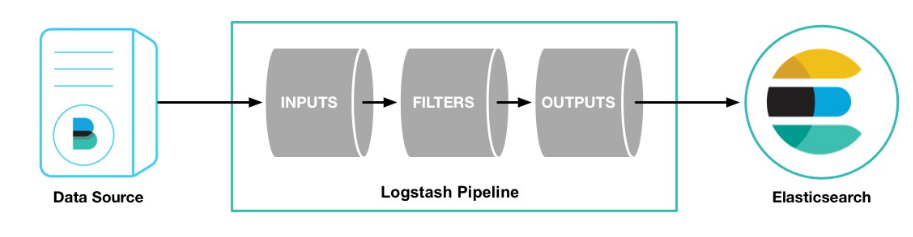

# Projet Exploratoire - Semestre 6  

  

*Desquiens Cyprien, Debray Mathieu, Thibeuf Antoine*

*En collaboration avec Legrand Florian et Zohari Fatemeh*

## Introduction

La finalité de ce projet est de permettre, grâce à la **collecte de traces d'activités** (**fichiers de logs**) des **machines virtuelles Netkit**, la réalisation et l'évolution d'**un tableau de bord** concernant les Travaux Pratiques des cours de Réseaux IP, enseignés par Mr. Yvan Peter. 

Ce résultat final devra entre autre permettre de proposer une solution afin de **superviser l'avancement** des étudiants dans les Travaux Pratiques. 

Pour cela les données recensées devront être stockées dans un moteur de recherche afin de permettre leur exploitation. 

## Analyse des besoins

Un moteur de recherche **seul ne permettra pas l'aboutissement** de ce projet, puisqu’il permettra uniquement d’indexer et stocker les données récoltées. Un complément sera donc **indispensable**.

Après réfléxion, nous avons défini les outils suivants comme étant vitaux à la réalisation d’un tableau de bord :

• Un moteur de recherche contenant les données  

• Une interface de visualisation permettant l'exploitation des données

Ces deux utilitaires sont destinés à être installés et configurés sur un poste orienté **Serveur**. C’est donc une machine complète qu’il va falloir monter.

Il nous est également demandé de définir comment les traces d’activités côté devront être récupérées, ceci sera effectué grâce à des scripts d’automatisation rédigés en **bash**, ces derniers permettront alors la création de fichiers de logs contenant les dites traces d’activités.

Dans un soucis d’optimisation, deux outils supplémentaires seront déployés côté **Client** :

• Un outil de collecte des fichiers de logs  

• Un outil permettant d'ingérer les données dans le moteur de recherche situé vers un serveur

La **récolte un à un** des divers résultats et **la transition fichiers de texte vers données stockées dans un moteur de recherche** étant pénible manuellement, ces deux outils couplés aux scripts permettront une automatisation totale sur les potes à superviser, faisant gagner ainsi un temps de productivité non négligeable.

## La gamme Elastic

[1]: https://www.elastic.co/fr/

Afin de mener à bien ce projet Universitaire, notre choix de solution s'est porté sur la suite **[Elastic][1]**. Il s’agissait au départ d’une contrainte de sujet (au niveau du moteur de recherche) mais nous nous sommes aperçus qu’il semblait tout à fait judicieux de se tourner vers elle.

Sous licence Apache et disponible en **Open Source**, cette gamme propose plusieurs **logiciels libres** dont quatre vont nous servir au bon fonctionnement de notre projet :

• Elastic Search constitue le moteur de recherche  

• Kibana est l'outil d'exploitation  

• Filebeat sert d'agent de collecte des données 

• Logstash gère la transition vers le moteur de recherche

Chacun de ces logiciels correspond donc à un besoin définit dans la section précédente et dispose d'une documentation officielle anglaise très fournie qui permet d'avoir un bon fonctionnement lors de la mise en place. 

C'est sur ces bases que nous nous sommes principalement appuyé, plutôt que de recherches divers tutoriels de droite à gauche.

## Déroulement des activités

En reprenant la base de ce qui a été évoqué dans l'analyse des besoins, nous avons dédicé du cheminement ci-dessus pour le déroulement du projet :

• Mise en place du poste de Monitoring

•  Installation et configuration du moteur de recherche et de l'interface d'exploitation des données

•  Rédaction des scripts

•  Installation et configuration d'outils de collecte et de gestion des logstash

•  Construction du tableau de bord


## Documentation
  
### Mise en place du poste de Monitoring

***

#### Pré-requis

Afin de mettre en place le serveur faisant office de poste monitoring, un socle, notre choix du système d'exploitation s'est porté sur **Debian** afin de rester dans la philosophie de l’Université. Ce serveur est donc virtualisé sur un poste physique et installé **sans interface graphique** avec pour seule option choisie **serveur ssh**, afin de permettre un accès distant et une configuration optimale.  

La mise en place de ce projet nécessite des performances particulières, Elastic Search étant très gourmand en ressources, au moins **4 Go de mémoire vive sont conseillés**, sinon plusieurs messages d’erreurs seront affichés au moment de son lancement.

***

#### Java

La suite Elastic doit disposer de la dernière version de Java d'installée afin de pouvoir fonctionner correctement, cette installation doit se faire proprement  :

```bash
nano /etc/apt/sources.list.d/java-8-debian.list

deb http://ppa.launchpad.net/webupd8team/java/ubuntu trusty main  
deb-src http://ppa.launchpad.net/webupd8team/java/ubuntu trusty main

# Ajout des dépôts officiels dans un nouveau fichier

apt-key adv --keyserver keyserver.ubuntu.com --recv-keys EEA14886

# Importation de la clef GPG afin de valider les paquets avant l’installation

apt-get update  

apt-get install oracle-java8-installer
```

On vérite ensuite à l'aide de la commande : **java -version**

```bash
java version "1.8.0_121"  
Java(TM) SE Runtime Environment (build 1.8.0_121-b13)  
Java HotSpot(TM) 64-Bit Server VM (build 25.121-b13, mixed mode) 
```

***

#### Serveur Web Apache

Vient ensuite l'installation d'un serveur web **Apache** qui sera nécessaire pour l'accès aux interfaces d'administration et de visualisation des futures données. 

On peut également installer un navigateur web si l’on souhaite effectuer ces opérations en local :

```bash
apt-get install apache2  
apt-get install firefox-esr 
```

L'accès au navigateur se fera alors tout simplement avec la commande **firefox**, le serveur n'ayant pas d'interface graphique, l'application sera déportée sur l'hôte distant, et c'est la que la configuration du SSH entre en compte.

***

#### Accès distant via SSH

Côté **serveur**, la configuration passe par le fichier principal afin de permettre l’autorisation de connexion en tant qu’utilisateur root : **nano /etc/ssh/sshd_config** 

```bash
PermitRootLogin yes 	# Remplacer without-password par yes

service ssh restart		# Rédémarrage du service
```

Côté **client**, la clef publique est partagée avec le serveur : **ssh-copy-id root@192.168.194.193**

La même opération est éxécutée pour l’utilisateur **user**. 

Pour éviter de devoir utiliser l’adresse IP à chaque connexion, on précise un nom d’hôte : 

```bash
nano ~/.ssh/config

Host projet
	hostname 192.168.194.193
 	user root
	user user
```
        
Puis refaire la manipulation en sens inverse côté serveur. 

Il est désormais possible de se connecter en SSH sur le serveur avec la commande suivante :

```bash
ssh -X projet
```

L'option renseignée permettra à l'hôte distant d'avoir accès aux applications graphiques déportées.


***

### Suite Elastic

***

#### Procédure d'installation

Les divers logiciels de la gamme que nous utiliserons possèdent dans l'ensemble la même procédure d'installation (à quelques détails près, ceux ci seront spécifiés dans la section appropriée).

Celle ci commence par récupérer un dossier d'installation disponible sous plusieurs formats :

> • ZIP  
> • TAR  
> • DEB  
> • RPM

Nous avons choisis le format **tar** pour une meilleure portabilité et gestion des logiciels, n'ayant pas l'accès aux **droits root** sur les postes de l'Université.

Certains seront certes sur un serveur virtualisé mais ce choix permet de garder une certaine cohérence et cohésion tout au long de ce projet.

Une fois le dossier récupéré (commande **wget**) et extrait (commande **tar**), le logiciel se lance grâce à un script d'éxécution situé dans un dossier **/bin** (exemple : **./nom_logiciel**)

Le principal inconvénient de cette solution est que chaque logiciel nécessite un terminal pour être lancé, il n'est plus possible de les lancer en tant que processus (**daemon**) en arrière plan avec les nouvelles versions.

La liste des logiciels disponibles au téléchargement se trouve ici.

***

#### Exemple d'installation pour Elastic Search

A l’aide des commandes décrites plus haut :

• Récupérer le dossier d’installation  elasticsearch5.2.2.tar.gz sur le site officiel

• Extraire l’archive obtenue

• Se rendre dans le dossier contenant le script de lancement

• Executer le script tel quel sans paramètres

On constate donc que l’accès aux logiciels est relativement aisée, ceci consitue un de nos arguments pour justifier le fait d’avoir choisit cette gamme.

***

### Elastic Search - Moteur de recherche

***

#### Prise en main

Afin que le moteur de recherche se lance sans problèmes, il faut s'assurer que l'exécution du script se fasse en tant que **user** et **non en tant que root pour des raisons de sécurité**, pour cela vérifier qu'user a les droits sur le dossier et qu'il en est le propriétaire : **ls -l**

```bash
drwxr-xr-x 7 user user     4096 févr.  9 23:08 elasticsearch-5.2.2
```

Par la suite nous utiliserons très fréquemment la commande **curl** (**Client URL Request Library**) qui permet d'éxécuter des requêtes de téléchargement et d'envois de données à travers différents protocoles (HTTP en l'occurence). 

Car Elastic Search a besoin d'écouter sur un port (9200 en l'occurence) mais il ne dispose pas d'interface graphique d'administration, malgré la nécessité d'installer un serveur web Apache.

On va donc vérifier que le serveur est bien opérationnel : **curl http://localhost:9200/**

Ce qui nous retourne donc :

```bash
{
  "name" : "GOxHO8a",
  "cluster_name" : "elasticsearch",
  "cluster_uuid" : "BAt923UWTd638H-sDkFGIw",
  "version" : {
    "number" : "5.2.1",
    "build_hash" : "db0d481",
    "build_date" : "2017-02-09T22:05:32.386Z",
    "build_snapshot" : false,
    "lucene_version" : "6.4.1"
  },
  "tagline" : "You Know, for Search"
}
```

#### Notions de bases

Tout fonctionne jusqu'ici, on constate qu'un nom a été généré aléatoirement pour le noeud et que le cluster a un nom pré-défini (**elasticsearch**). 

Un **Cluster** consiste en un regroupement de un ou plusieurs **Noeuds** (**Nodes**), il est identifié par un nom unique. C'est le cluster qui va permettre l'indexation et les recherches de données. Pour ce projet, nous n'utiliserons qu'un seul noeud avec notre cluster, puisque la portée est uniquement local pour le moment.

Un **Noeud** (**Node**) quant à lui est en réalité un serveur qui contient des données et qui va s'associer avec un cluster. Vu que nous utilisons un seul poste de Monitoring, nous n'aurons besoins ici que d'un seul noeud.

Le nom du noeud ainsi que le nom du cluster peuvent être modifiés, nous les définirons comme ceci lors du lancement d'Elastic Search :

```bash
./elasticsearch -Ecluster.name=cgir -Enode.name=exploiratoire
```

Un autre terme essentiel à connaître est celui d'**Index**, c'est dans celui ci que seront regroupées les données.

Pour les besoins de ce projet, on pourrait donc définir un index par Travaux Pratiques.

Les données sont collectées en tant que **Documents** qui sont indexés chacun leur tour (un document pour un produit d'un catalogue, un document pour un client bancaire ...). Ces documents sont rédigés en **JSON** (**JavaScript Object Notation**), qui est un format de données.

Il existe d'autres termes relatifs à Elastic Search : **[Documentation Elastic Search][3]**

[3]: https://www.elastic.co/guide/en/elasticsearch/reference/current/_basic_concepts.html

Ils ne seront pas abordés ici car comme dit plus haut la portée de ce projet est pour le moment restreinte.

#### Manipulations

Ce qui sera abordé dans cette section ne sera pas forcément utile pour ce projet. Néanmoins, nous avons choisis de décrire succintement quelques opérations possibles avec ce moteur de recherche, afin que son fonctionnement soit mieux compris.

Voici une liste des manipulations de base qu'il est possible d'effectuer avec **curl** vers le moteur :

```bash
curl -XGET 'localhost:9200/_cat/health?v&pretty'	# Etat du serveur

curl -XGET 'localhost:9200/_cat/nodes?v&pretty'		# Liste des noeuds		

curl -XGET 'localhost:9200/_cat/indices?v&pretty'	# Liste des indexs

curl -XPUT 'localhost:9200/netkit?pretty&pretty'	# Création d'un index

curl -XDELETE 'localhost:9200/netkit?pretty&pretty'	# Suppression d'un index
``` 

On constate donc dans la syntaxe que **netkit** représente **le nom de l'index**. 

Ce dernier étant opérationnel,  on peut donc commencer à lui faire parvenir des données fictives, afin de se familiariser avec le moteur :

```bash
curl -XPUT 'localhost:9200/netkit/external/1?pretty&pretty' -H 'Content-Type: application/json' -d'  

{
  "name": "Antoine Thibeuf"
}
'
```

Ici on a donc déclaré un champ "**name**" avec pour contenu "**Antoine Thibeuf**". 

Cette commande nous renvoit ensuite l'information qui confirme que les données (de type **external** comme définit dans la requête) ont bien été ajoutées dans l'index, ainsi que l'**ID** associé et le **numéro de version** sera incrémenté à chaque manipulation de ce document :

```bash
{
  "_index" : "netkit",
  "_type" : "external",
  "_id" : "1",
  "_version" : 1,
  "result" : "created",
  "_shards" : {
    "total" : 2,
    "successful" : 1,
    "failed" : 0
  },
  "created" : true
}
```

Ce qu'il faut principalement retenir, c'est que pour les opérations, ayant pour objet des documents, ont  généralement le pattern modèle suivant : 

```
< url >/< index >/< type >/< id >
```

On peut également vérifier manuellement en précisant l'index, le type de document ainsi que l'ID :  

```bash
curl -XGET 'localhost:9200/netkit/external/1?pretty&pretty'
```
```bash
{
  "_index" : "netkit",
  "_type" : "external",
  "_id" : "1",
  "_version" : 1,
  "found" : true,
  "_source" : {
    "name" : "Antoine Thibeuf"
  }
}
```

Le champ **source** retourne alors tout le contenu du document. Bien entendu, il est également possible de supprimer un document soi-même :

```bash
curl -XDELETE 'localhost:9200/netkit/external/1?pretty&pretty'
```

La denière manipulation possible étant la mise à jour d'un document, avec par exemple l'ajout d'un nouveau champ : 

```bash
curl -XPOST 'localhost:9200/netkit/external/1/_update?pretty&pretty' -H 'Content-Type: application/json' -d'
```

```bash
{
  "doc": { "name": "Thibeuf Antoine Toto", "age": 20 }
}
'
```

On peut également utiliser quelques petits scripts pour mettre à jour un champ particulier :

```bash
curl -XPOST 'localhost:9200/netkit/external/1/_update?pretty&pretty' -H 'Content-Type: application/json' -d'
```

```bash
{
  "script" : "ctx._source.age += 2"
}
'
```

Ici la valeur du contenu du champ age a donc été **incrémentée** de 2.

#### Accès publique du serveur

Lors de son éxécution, Elastic Search pointe directement sur une adresse locale, des modifications sont à effectuer si l’on veut qu’il pointe vers une autre addresse :

```bash
nano /exploratoire/elasticsearch-5.2.2/config/elasticsearch.yml

# Edition du fichier de configuration

network.host: 192.168.194.193

# Décommenter cette ligne et indiquer l'adresse IP souhaitée
```
En relançant le serveur, on constate que des erreurs se produisent :

```
bound or publishing to a non-loopback or non-link-local address, enforcing bootstrap checks
ERROR: bootstrap checks failed
max virtual memory areas vm.max_map_count [65530] is too low, increase to at least [262144]
```
La commande suivant permet de pallier à ce problème :

```bash
sysctl -w vm.max_map_count=262144
```

La commande **sysctl** est utilisée pour modifier les paramètres du **noyau** (**kernel**) au moment où la machine virtuelle est en fonction, en précisant le paramètre à modifier (option **-w**), la **Virtual Memory** (**vm.max_map_count**) est donc augmentée.

***

### Kibana - Exploitation des données

***

#### Prise en main 

Kibana est l'outil permettant l'exploitation et la visualisation des données contenues dans le moteur de recherche, l'installation se déroule de la même manière que ce dernier.

Cependant après plusieurs tests, nous avons constaté que la **version 64-BIT ne fonctionnait pas sur certain postes**, dans ce cas, préférez la **version 32-BIT**.

On doit toutefois indiquer à cet outil où pointer vers l'instance d'Elastic Search : 

```bash
nano /exploratoire/kibana-5.2.2-linux-x86_64/config/kibana.yml

elasticsearch.url
```

L'accès à l'interface se fait ensuite via le serveur web sur **le port 5601** : http://localhost:5601

#### Notions

Afin de permettre l'affichage de données, il faut définir un **Index Patterns** dès la première visite de l'interface.

Un Index Patterns permet de rassembler plusieurs indices à la fois afin d'avoir accès aux données.

Voici un exemple : ```net-*```

Ceci permettra donc de regrouper tous les indexs commençant par "**net**". Il est également possible de définir plusieurs modèles. Il faut aussi noter que les indexs doivent exister dans Elastic Search.

Pour le moment, aucune donnée n'est renseignée dans le moteur d'Elastic Search, cette définition sera donc abordée dans la troisième partie de la documentation.

#### Accès publique du serveur

Tout comme pour Elastic Search, il serait plutôt utile de rendre l'accès publique à l'interface de Kibana. Pour ce faire, se rendre dans le fichier de configuration (**config/kibana.yml**), supprimer la dernière ligne renseignée plus haut puis effectuer les modifications suivantes :

```bash
server.host: 192.168.194.193

# Décommenter cette ligne puis indiquer l'addresse IP souhaitée

elasticsearch.url: http://192.168.194.193:9200

# Même principe ...
```

***

#### Elastic Search Head - Interface d'administration

Par défaut, Elastic Search ne dispose pas d’un outil d’administration graphique. Les modifications sont donc à effectuer en dur avec la commande curl, ce qui ne peut pas se révéler pratique à la longue. Nous avons donc choisis d’installer également une interface graphique d’administration au cas où le besoin s’en ferait ressentir.

La plus populaire étant Elastic Search Head qui nécessite d’avoir un serveur tournant à part :

```
apt-get install git  
apt-get install node
apt-get install npm

git clone git://github.com/mobz/elasticsearch-head.git  

cd elasticsearch-head  
 
npm install   
npm install -g grunt-cli  

grunt server   
```

Si un problème survient après l'éxécution de la commande **npm install**, la combinaison suivante permet d'y pallier : 

```bash
npm cache clean -f  
npm install -g n  

n stable  
```

Le serveur est donc lancé, l'accès se fait toujours localement sur **le port 9100**, afin de le connecter à Elastic Search (qui lui écoute sur le port 9200), une modification est à inscrire dans le fichier de configuration principal (**config/elasticsearch.yml**) :

```
http.cors.enabled: true  
http.cors.allow-origin: "*"  
http.cors.allow-headers: Authorization  
```

***

### Récupération des traces

***

#### Définition des besoins de récupération d'activités

Pour cette partie nous nous baserons principalement sur le premier Trauvail Pratique de Réseaux IP, et plus précisement sur la première partie. 

Celle ci se décompose en plusieurs étapes, qui sont respectivement :

> • Configuration manuelle de l'adresse IP et allumage de l'interface (commande **ip**)    
> 
> • Configuration de l'adresse IP via un fichier spécifique (fichier **/etc/network/interfaces**)  
>
> • Communication avec le deuxième poste (commande **ping**)

On part donc sur la base d'un script pour une vérification de chaque étape, les résultats de cette vérification seront donc envoyés vers des fichiers de logs crées par nous même (via le script en lui même donc).

La syntaxe retenue est la suivante : ```<jour>-<heure> <numéro_check> : <hôte> <message>``` 

Les commandes **date** et **hostname** seront donc utilisées afin de connaître le temps ainsi que le nom d'hôte de la machine (comme deux machines virtuelles au minimum sont en fonction).

Les fichiers crées seront localisés dans le dossier **/hosthome** qui correspond à un dossier partagé entre la machine virtuelle et la machine physique, soit **/home/nom_utilisateur** sur le poste.

***

#### Rédaction des scripts d'automatisation

Voici quelques exemples de scripts basiques pouvants servir à la création de fichiers de logs.

**Configuration manuelle de l'adresse IP et allumage de l'interface :**

```bash
#!/bin/bash

#######################################################
# Vérifie si l'interface réseau est configurée        #
#######################################################

date=$(date +%d/%m/%Y-%T)

checkip=$(ip address | sed -n '/eth0/,/forever/p')

# Utilisation de la commande sed > ne garder que la partie sur l’interface eth0

# Vérifier si l’adresse IP est configurée ou non

if grep -q '192.168.1.1' <<< $checkip

then
        echo -e  $date "check01 : `hostname` Adresse IPv4 configurée" >> /hosthome/manual_check.log

else
        echo -e  $date "check01 : `hostname` Addresse IPv4 non configurée" >> /hosthome/manual_check.log

fi

# Ecriture du résultat dans un fichier (constitution des logs)

# Vérifier si l’interface est allumée ou non

if grep -q 'DOWN' <<< $checkip

then
        echo -e $date "check02 : `hostname` Interface eth0 éteinte\n" >> /hosthome/manual_check.log

elif grep -q 'UNKNOWN' <<< $checkip

then
        echo -e $date "check02 : `hostname` Interface eth0 allumée\n" >> /hosthome/manual_check.log

else
        echo -e $date "check02 : `hostname` Interface eth0 allumée (UP)\n" >> /hosthome/manual_check.log

fi
```

**Configuration de l'adresse IP via un fichier spécifique :**

```bash
#!/bin/bash

################################################################################
#                 Vérifie le fichier /etc/network/interfaces   			       #
################################################################################

date=$(date +%d/%m/%Y-%T)

if grep -q 'static' /etc/network/interfaces

then
        echo -e $date "check01 : `hostname`   Interface eth0 statique" >> /hosthome/interface_check.log

else
        echo -e $date "check01 : `hostname`   Interface eth0 dynamique" >> /hosthome/interface_check.log

fi

if grep -q 'address' /etc/network/interfaces

then
        echo -e $date "check02 : `hostname`   Addresse IP configurée" >> /hosthome/interface_check.log

else
        echo -e $date "check02 : `hostname`   Adresse IP non configurée" >> /hosthome/interface_check.log

fi

if grep -q 'netmask' /etc/network/interfaces

then
        echo -e $date "check03 : `hostname`   Masque de sous réseau déclaré\n" >> /hosthome/interface_check.log

else
        echo -e $date "check03 : `hostname`   Masque de sous réseau non déclaré\n" >> /hosthome/interface_check.log

fi
```

Ici on suppose que si un étudiant a définit les diverses options tel que **address** et **netmask**, les paramètres qui  suivent juste après sont corrects (puisqu’il les a précédemments configurés manuellement, et que ceux ci sont également indiqués dans l'énoncé du Travail Pratique).

```bash
#!/bin/bash

################################################################################
#             Vérifie la communication entre les deux postes 	    #                                 
################################################################################

date=$(date +%d/%m/%Y-%T)

checkping=$(ping -c 4 192.168.1.2)

if grep -q '64 bytes from 192.168.1.2' <<< checkping

then
		echo -e $date "check01 : Ping PC2 : OK\n" >> /hosthome/ping_check.log

else
		echo -e $date "check01 : Ping PC2 : NON OK\n" >> /hosthome/ping_check.log

fi
```

On a donc créé nos premiers fichiers de logs pouvant servir à l’élaboration d’une première ébauche du tableau de bord.

La deuxième partie du Travail Pratique est similaire à la première, avec l’ajout d’un routeur, dans ce cas ci on pourrait alors effectuer des vérifications au niveau de la commande **ip route** et de l’option **gateway** du fichier **/etc/network/interfaces**.

#### Automisation des scripts

Afin d'optimiser l'automatisation des scripts, le service **cron** va se révèler très utile en appelant les scripts au moment voulu par l'administrateur et ce de manière automatique, pour cela il faut d'abord activer le service sur les machine virtuelles (désactiver par défaut sur **netkit**) : : 

```bash
nano .bashrc

# Edition du fichier de configuration

/etc/init.d/cron start

# Rajouter cette ligne à la fin
```

Pour prendre en compte les modifications sans avoir à redémarrer la machine :

```bash
bash
```

On édite ensuite la configuration du service :

```bash
crontab -e

# Commande permettant d'éditer le fichier de configuration

# Puis indiquer les lignes suivantes dans la table

* * * * * /root/test_01.sh && /root/test_02.sh && /root/test_03.sh
```

Ici on a donc définit l’execution simultanée (opérateur **ET** grâce à l’indicateur **&&**) des trois scripts toutes les minutes à titre d’exemple, on laissera le choix à Mr. Peter de définir chaque intervalle … 

Les fichiers de logs sont donc désormais mis en place, il ne reste plus qu'à les collecter et à les insérer dans Elastic Search.
***

#### Association Filebeat & Logstash



L'idéal serait d'utiliser un outil de collecte des différents fichiers de logs afin de les transmettre à un autre outil qui va se charger de les transformer et de les envoyer vers le moteur de recherche, c'est le rôle de Filebeat et Logstash  que nous allons donc utiliser. 

L'objectif est donc d'installer Filebeat sur chaque machine physique afin de récupérer les logs des machines virtuelles netkit disponibles dans **/hosthome**, quant à Logstash il sera installé sur la machine physique de Mr. Peter mais **non virtualisé**, le logiciel se chargera ensuite d'envoyer les données sur le serveur (probablement) virtualisé accueillant le moteur de recherche.

Ces deux logiciels doivent avoir un fichier de configuration définit au préalable : nano logstash.conf	
Ce fichier doit contenir les directives **input** et **output** (**Entrée et Sortie**) afin d'indiquer la source des données et où elles doivent être transmises une fois que Logstash a terminé de les transformer : 

```bash
input {	
				
	beats {				
    	port => "5043"	
    }
}

output {
				
	elasticsearch {
    	hosts => [ "192.168.194.193:9200" ] 
    }
    
    stdout {
        codec => rubydebug
    } 
}
```

On a donc indiqué que Logstash prend **en entrée les données envoyés par Filebeat** (utilisation d’un **plugin**) qui écoute sur **le port 5043**, et qu’il **enverra le résultat vers Elastic Search situé à l’adresse IPv4 déclarée**.

L’option renseignée juste après permettra d’avoir un **debug en live** (au moment de la gestion des logs sur le terminal où Logstash est éxécuté).

Au tour de Filebeat : **nano filebeat.yml**

Ce fichier existe déjà par défaut mais nous avons préférer l’effacer afin de repartir d’une configuration claire.

En ce qui concerne le fichier de configuration, le principe est similaire à celui de Logstash, on retrouve les directives **input** (où se trouvent les fichiers à collecter) et **output** (où les envoyer) :

```bash
filebeat.prospectors:
- input_type: log						
  paths:                         	
    - /home/infoetu/thibeufa/nom_fichier.log

output.logstash:						
  hosts: ["172.18.48.243:5043"]
```
Puis on lance l'application Logstash avec pour paramètre le fichier de configuration (option -f), l'option indiquée juste après permet de recharger automatiquement la configuration sans avoir besoin de redémarrer Logstash :

```bash
bin/logstash -f logstash.conf --config.reload.automatic
```

L'option **--config.test_and_exit** quant à elle permet de vérifier la configuration. On peut également noter que la configuration peut se faire directement en ligne de commande grâce à l'option **-e** mais ceci est moins pratique.

Même principe pour Filebeat :

```bash
./filebeat -e -c filebeat.yml -d "publish"
```

Voici un exemple de logs publiés vers Logstash :

```bash
2017/03/23 12:50:07.096815 output.go:109: DBG  output worker: publish 2 events
2017/03/23 12:50:07.102406 sync.go:68: DBG  Events sent: 3
2017/03/23 12:50:17.053225 logp.go:230: INFO Non-zero metrics in the last 30s: libbeat.publisher.published_events=2 libbeat.logstash.call_count.PublishEvents=1 libbeat.logstash.publish.write_bytes=302 registrar.states.update=3 libbeat.logstash.publish.read_bytes=6 publish.events=3 registrar.writes=1 libbeat.logstash.published_and_acked_events=2
2017/03/23 12:50:47.053260 logp.go:232: INFO No non-zero metrics in the last 30s
2017/03/23 12:51:12.099313 client.go:184: DBG  Publish: {
  "@timestamp": "2017-03-23T12:51:07.107Z",
  "beat": {
    "hostname": "teck12",
    "name": "teck12",
    "version": "5.2.2"
  },
  "input_type": "log",
  "message": "23/03/2017-13:51:01 check01 : pc1 Addresse IPv4 non configurée",
  "offset": 2770,
  "source": "/home/infoetu/desquiec/manual_check.log",
  "type": "log"
}
2017/03/23 12:51:12.099439 client.go:184: DBG  Publish: {
  "@timestamp": "2017-03-23T12:51:07.107Z",
  "beat": {
    "hostname": "teck12",
    "name": "teck12",
    "version": "5.2.2"
  },
  "input_type": "log",
  "message": "23/03/2017-13:51:01 check02 : pc1 Interface eth0 éteinte",
  "offset": 2828,
  "source": "/home/infoetu/desquiec/manual_check.log",
  "type": "log"
}
```

Qui lui de son côté les transforme sans soucis :

```bash
{
    "@timestamp" => 2017-03-23T12:52:02.110Z,
        "offset" => 2893,
      "@version" => "1",
    "input_type" => "log",
          "beat" => {
        "hostname" => "teck12",
            "name" => "teck12",
         "version" => "5.2.2"
    },
          "host" => "teck12",
        "source" => "/home/infoetu/desquiec/manual_check.log",
       "message" => "23/03/2017-13:52:02 check01 : pc1 Addresse IPv4 non configurée",
          "type" => "log",
          "tags" => [
        [0] "beats_input_codec_plain_applied"
    ]
}
```

***

### Gestion des logs côté serveur

***

#### Vérification du moteur Elastic Search

On peut constater en listant les indexs, que les logs précédemment envoyés ont bien été ingéré dans le moteur :

```
curl -XGET 'localhost:9200/_cat/indices?v&pretty'
```
Et on retrouve donc dans la liste des indexs :

```
logstash-2017.03.23
```

***

#### Défition de l'Index Pattern

Maintenant que le moteur Elastic Search contient bien des données, c'est au tour de Kibana.

Cette étape sera automatiquement proposée lors de l’accès à l’interface graphique.

Cette configuration est assez simple puisque Kibana propose un nom par défaut que nous allons conserver :

```
logstash-* 
```
On laisse également cocher la case **"Index contains time-based events"** puis on crée l'Index Pattern.

***

#### Construction du tableau de bord

Toujours dans Kibana, onglet **Discover**, on peut observer les données en brut du moteur suite à la définition de l'Index Pattern, on va affiner cette recherche en sélectionnant quelques champs pertinents tel que **host**, **message** et **source**. 

[4]: https://image.noelshack.com/fichiers/2017/12/1490274016-1.png

**[Voila donc une première ébauche de tableau de bord :][4]**

On peut ensuite sauvegarder cette recherche grâce au bouton **Save** situé un peu plus haut.

A propos du champ **@timestamp**, on constate que celui correspond en réalité au moment où le log est récupéré et transformé, ce qui est moins intéressant dans notre situation. La case côchée plus haut ne sera plus forcément utile par la suite.

Il est également possible de regrouper plusieurs tableaux de bords pour plusieurs Travaux Pratiques, pour cela se rendre dans l'onglet **Dashboard** et ajouter les diverses recherches ,préalablement sauvegardées, grâce au bouton **Add** puis onglet **Saved Search**.

On remarque cependant que les lignes des logs sont mélangées entre elles, il est possible de remettre un peu ordre en vérifiant soit-même la colonne **source** mais ce n'est pas pratique, il vaudrait trier les colonnes directement. Ce qui n'est dans l'immédiat pas possible et qui nous retourne le message d'erreur suivant :

```bash
Fielddata is disabled on text fields by default. Set fielddata=true on [source] in order to load fielddata in memory by uninverting the inverted index. 
```

Ceci du au fait qu’il **n’est pas possible de trier des colonnes de type texte** par défaut, pour résoudre ce problème il va falloir effectuer un **mapping** dans le moteur de recherche. Cela consiste à définir comment les données vont être indéxées et stockées avant même leur arrivée dans Elastic Search.

Cependant, si le tri est effectué avec la colonne **Time, la colonne Host** est dans le bon ordre, bien que les lignes de logs soient toujours mélangées.

***

### Remarques

***

#### Problèmes, améliorations ...

On remarque tout au long de l'évolution de ce projet qu'il s'est écarté de l'objectif initial (tel que définit dans l’introduction) "**récupération des traces d'activités**" au profit de **vérifications à l'aide de commandes internes**. Cela est du au fait que la rédaction de scripts suivant le point de départ s'avérait plutôt difficile.

Néanmoins, cette solution permet quand même de suivre l'activité des Travaux Pratiques, en vérifiant après la séance jusqu'où sont allés les étudiants par exemple.

Un autre défaut est que du à la nature des logs récupérés, il n'est pas vraiment possible d'exploiter les fonctionnalités qu'offre l'onglet **Visualize** de Kibana.

Pour finir, nous avons manqué de temps pour pouvoir réaliser le mapping dans Elastic Search, résultant alors un travail demandant encore de l’amélioration. Ceci étant principalement du à une mauvaise gestion de projet.

***

### Conclusion

***

Ce projet a donc aboutit à une base (encore perfectible toutefois) sur laquelle Mr Peter pourra donc se pencher afin de mettre en place l'idée de supervision des Travaux Pratiques.

Tout au long du déroulement, nous avons pu constater que la gamme Elastic est plutôt riche et variée, certains de ses autres logiciels pourraient notamment servir à des fins d'optimisation ou d'amélioration (**Heartbeat**, **X-Pack**. 

Elle nous a également fait constater que les documentation officielles étaient un point de départ incontournable pour toute nouvelle utilisation dans le monde de l’informatique, et plus particulièrement dans le domaine d’UNIX.

Pour terminer, nous tenons à remercier toutes les personnes nous ayant permis de mener ce projet à bon terme.

***
